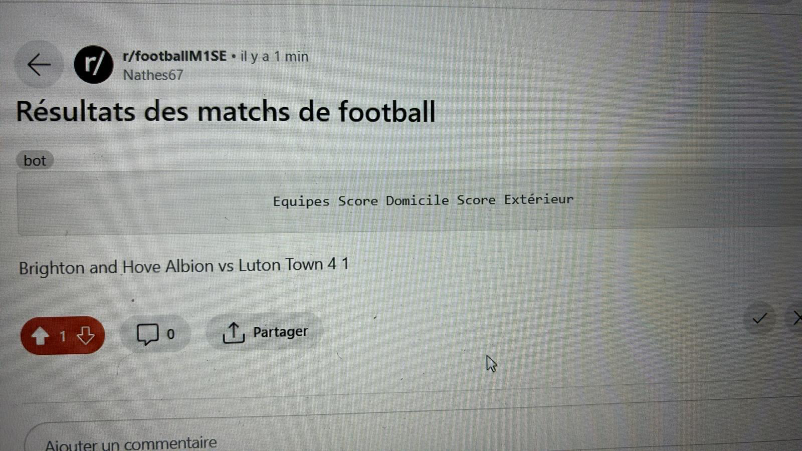
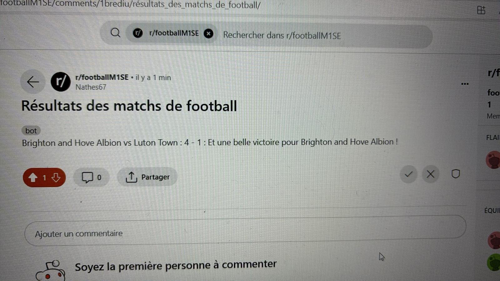
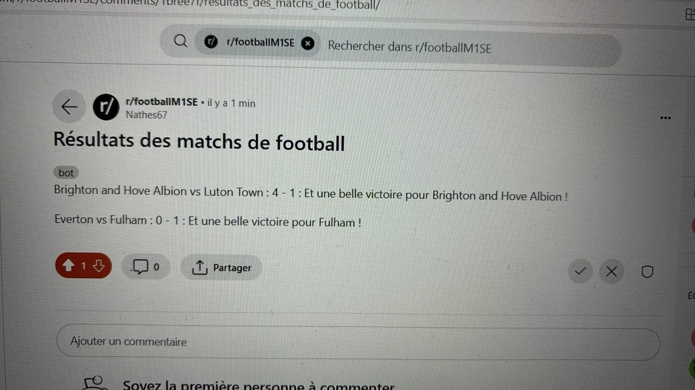
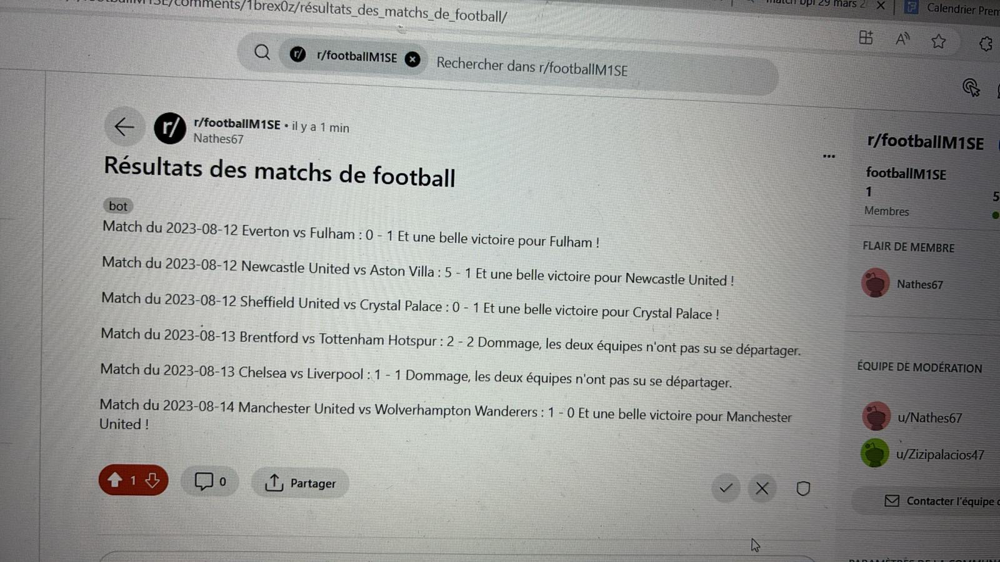
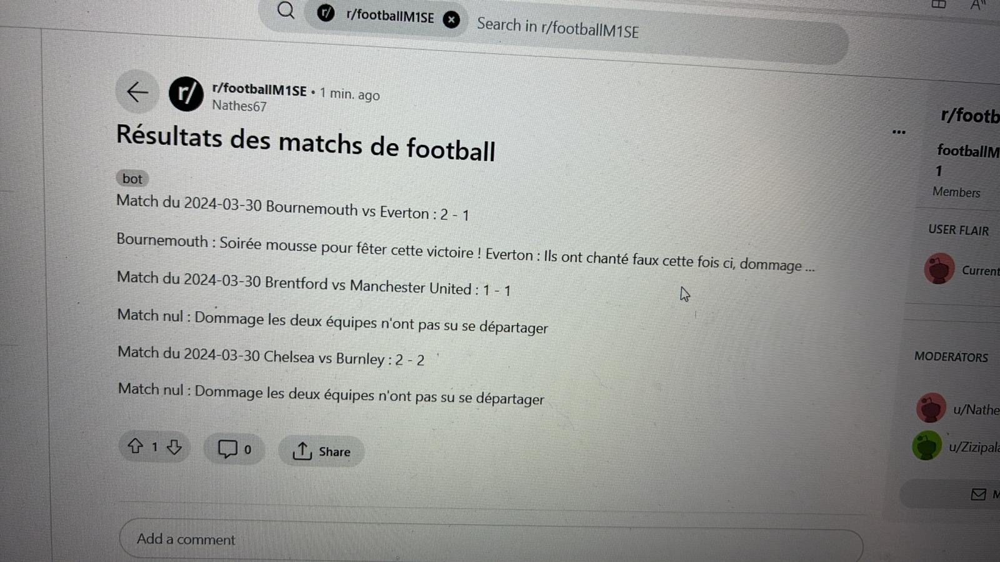
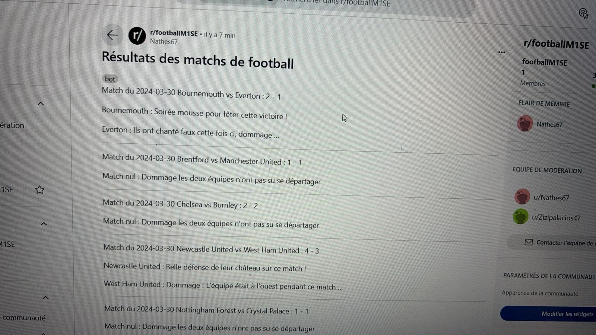

```{r setup, include=FALSE}
knitr::opts_chunk$set(echo = FALSE)
```


## Présentation du projet

- Ce projet vise à automatiser la publication des résultats de la Premier League.
  - La publication se fait sur le subreddit suivant : <https://www.reddit.com/r/footballM1SE/>.
  
  - Ce sont les résultats concernant la saison 2023-2024.
- Les posts sont publiés chaque jour.


## Explication des étapes du code

- Deux codes sont à disposition sur notre github : <https://github.com/nathanschild/code_projet>
  - Le code concernant la partie scrapping.
  - Le code concernant la partie création du bot reddit.
- Nous allons expliciter les étapes les plus importantes du code.

## La partie scrapping

- Les données des matchs proviennent du site suivant <https://www.skysports.com/premier-league>
- Il a fallu extraire les noms des équipes, le score, la date et statistiques associées aux matchs.
- Nous avons défini une fonction spécifique pour chaque information, voir exemple ci-dessous.

```{python,echo=T}
def extract_match_date(soup):

  match_date_tag = soup.find('time', {'class': 'sdc-site-match-header__detail-time'})
  return match_date_tag.get('aria-label').split(',')[1].strip() if match_date_tag else None
```

## La partie scrapping

- On définit ensuite la fonction 'main' qui va permettre de stocker les informations relatives aux matchs. 

```{python,echo=T}

def main():

    match_number = 482591
    
    match_data_list = []

    while match_number <= 482884:
        match_url = base_url + f"{match_number}/"
        match_data = scrape_match_details(match_url)
        match_data_list.append(match_data)

        match_number += 1
```

## La partie scrapping 

- Pour finir cette partie, on stocke tout dans un fichier excel :

```{python,echo=T,error=T,warning=F}

df = pd.DataFrame(match_data_list)

directory_path = "chemin du fichier"
file_path = os.path.join(directory_path,
"match_stats.xlsx")
```

## La création du bot reddit

- Il a d'abord fallu créer une application reddit 
  - Pour cela => <https://www.reddit.com/prefs/apps>
- Ensuite, il a fallu créer un subreddit puis utiliser la bibliothèque 'praw".

```{python,error=T,warning=F,echo=T}

reddit = praw.Reddit(client_id='/////',
                     client_secret='/////',
                     user_agent='/////',
                     username="/////",
                     password="/////")
```

## La création du bot reddit 

- Après avoir créé le bot reddit, il suffit de renseigner les informations que l'on souhaite poster.
- Pour faire en sorte que le bot publie les résultats des nouveaux matchs, il a fallu introduire une autre fonction :

```{python,error=T,warning=F,echo=T}
def check_for_new_data_and_post_on_reddit():
```

##Avancement du format du post
 







## La touche d'originalité
- Une idée a été d'accompagner chaque résultat par un petit commentaire lié aux noms des équipes.
- En voici un exemple :
```{python,echo=T,warning=F,error=T}
def commentaire_equipe_gagnante(equipe):
commentaires_gagnants = {
'Luton Town': "Aussi malicieux que des lutins !"}

def commentaire_equipe_perdante(equipe):
commentaires_perdants = {
'Burnley': "Ils ont été brulés …"}


```


## Let's practice !

## Points forts


## Points faibles à améliorer
Comme chaque équipe fait 19 marches, il y a potentiellement 19 défaites ou victoires. Rajouter des blagues.


## Conclusion


